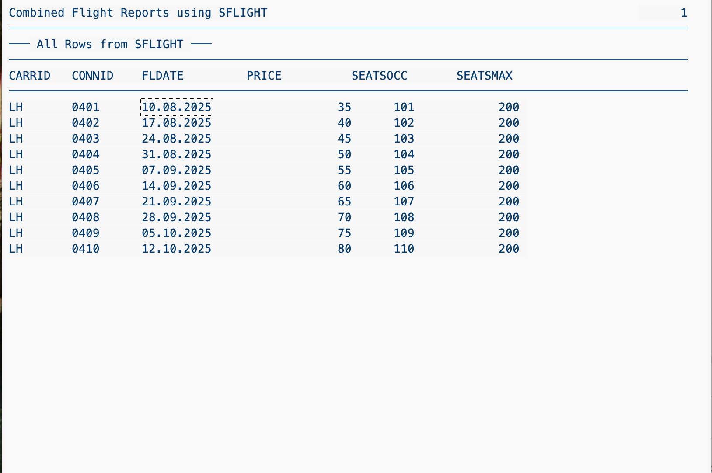
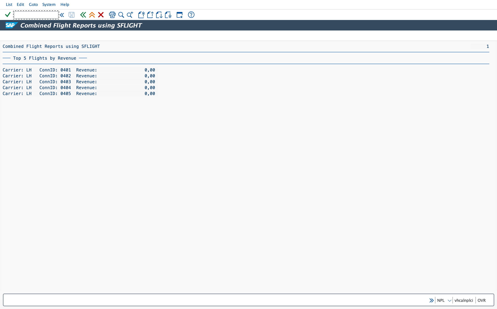
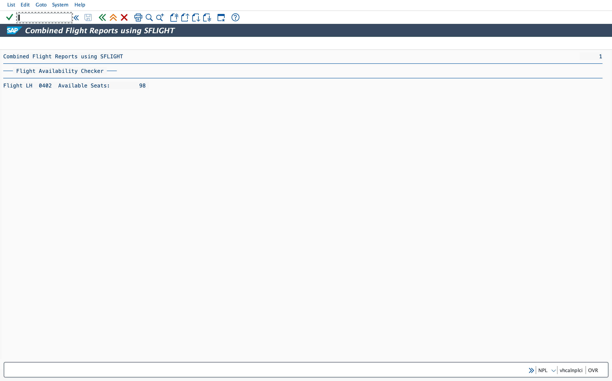
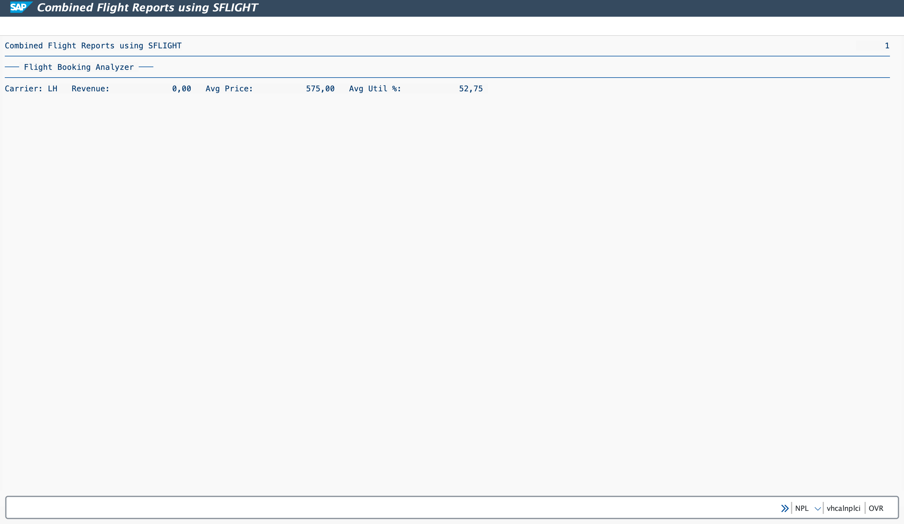
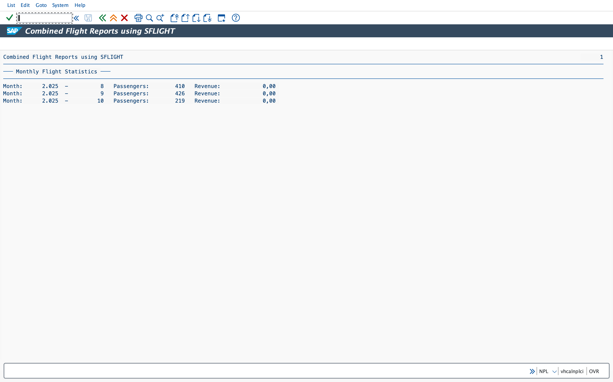
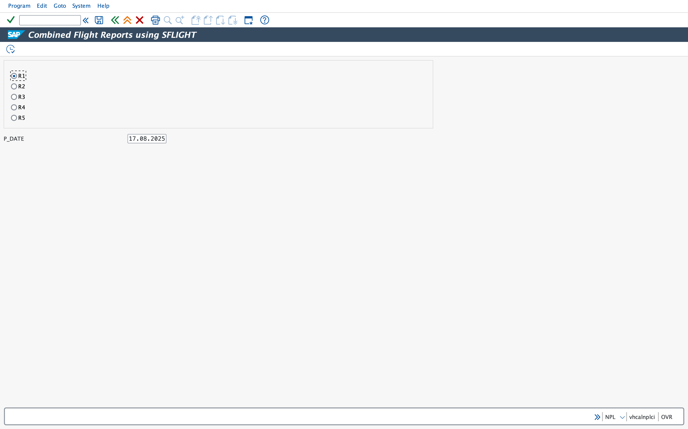

# ABAP Flight Data Reporting Project

A custom ABAP report built on the **SAP NetWeaver AS ABAP 7.52 trial system** using the `SFLIGHT` demo table.

## Features
- **Flight Booking Analyzer** – revenue, utilization, average price by carrier.
- **Flight Availability Checker** – seat availability on user-entered date.
- **Top 5 Flights by Revenue** – highest revenue-generating flights.
- **Monthly Flight Statistics** – passengers and revenue trends.

## Tech Stack
- ABAP (SE38, SE80)
- Open SQL, Internal Tables, Selection-Screen Programming

## Screenshots
- Table Contents

- Revenue Details

- Availability Check

- Booking Analyzer

- Monthly Status

- UI Layout

## How to Run
1. Copy code from `ZFLIGHT_PROJECT.abap` into SAP GUI (SE38).
2. Activate and run.
3. Select desired report via radio buttons.
